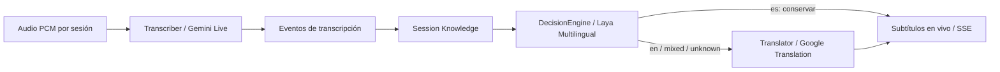

# Sintonizados

Accesibilidad para conferencias con muchas charlas simultáneas. Creado para la
Vibeathon de Nerdearla 2026. El nombre conecta **sintonizar una radio**, sintonizarse
con una charla y el proyecto **Sintonía**.

**API contract: Smithy 2.0 · Implementation: Go · Derived specification: OpenAPI 3.1**

## Qué hace



El contexto pertenece a cada charla. La percepción y la traducción usan interfaces
separadas; los eventos desacoplan el productor de transcripts de su consumidor.
El contrato transporta contexto y terminología para evolucionar hacia transferencia
de significado. La incorporación adaptativa de razonamiento todavía es futura.

## Implementado

- Sesiones independientes, ingestión PCM ordenada, cierre y errores visibles.
- Go HTTP, páginas HTML y JavaScript mínimo, originales parciales y subtítulos
  finales originales y en español por SSE; reconexión con historial acotado.
- Captura en vivo desde el navegador y conector de audio OBS por RTMP. El segundo
  usa MediaMTX y FFmpeg en contenedores; `/obs/{session_id}` sirve un overlay
  transparente para agregar como Browser Source en una escena OBS. La recepción
  está implementada; falta validar el flujo con OBS instalado en la máquina de demo.
- Adaptadores Gemini Live y Google Translation Basic; pruebas de protocolo con
  servidores locales. El usuario confirmó captura y traducción reales; la aceptación
  de dos sesiones con audio real sigue pendiente.
- Modo `demo` con frases programadas: prueba el transporte y la concurrencia,
  **no reconoce audio ni demuestra calidad de IA**.
- `SessionStore`, `EventBus`, `Transcriber`, `Translator`, `ReasoningEngine` y
  `DecisionEngine`; memoria local y Laya Multilingual oficial en servicio OCI
  separado, con fallback determinista. Clasificación por fragmento es/en/mixed/unknown,
  español preservado y división simple de mixed por puntuación.
- Logs JSON, tiempos por subtítulo y métricas Prometheus por sesión.
- Smithy validable, OpenAPI generado versionado, CI y herramientas OCI.

## Quick start

Requisitos del host: **git, Podman y shell POSIX** (Linux; utilidades básicas del
sistema). Necesitás red para descargar imágenes/dependencias la primera vez.
Go, Java, Python y validadores se ejecutan dentro de contenedores.

```sh
git clone https://github.com/munhof/sintonizados.git
cd sintonizados
./scripts/dev run
```

Abrí <http://localhost:8080>. El comando usa `.env.example`, publica únicamente en
loopback y requiere que el puerto 8080 esté libre. En otra terminal:

```sh
./scripts/dev feed -session charla-a -title 'Charla A' -demo &
pid_a=$!
./scripts/dev feed -session charla-b -title 'Charla B' -demo &
pid_b=$!
wait "$pid_a"
wait "$pid_b"
```

Cada fuente envía tres segundos de PCM silencioso. Visitá `/talks/charla-a` y
`/talks/charla-b` mientras se ejecutan. Se conservan los resultados al terminar;
reiniciar el servidor borra las sesiones. Usá IDs nuevos para repetir.

Para audio real, copiá `.env.example` a `.env`, configurá `PROVIDER_MODE=google`
y las dos claves, y arrancá con `ENV_FILE=.env ./scripts/dev run`:

```sh
ENV_FILE=.env ./scripts/dev feed -session real-a -title 'Audio real A' -file /data/audio-a.pcm &
pid_a=$!
ENV_FILE=.env ./scripts/dev feed -session real-b -title 'Audio real B' -file /data/audio-b.pcm &
pid_b=$!
wait "$pid_a"
wait "$pid_b"
```

`/data` es el repositorio montado en el emisor. Los archivos deben ser **PCM s16le,
mono, 16 kHz, sin encabezado WAV**. Ver [audio y operación local](docs/operations/local.md).

### OBS en vivo

Con OBS instalado, iniciá el receptor local y configurá OBS en **Settings → Stream**:

```sh
./scripts/dev obs-start
```

- Service: `Custom...`
- Server: `rtmp://127.0.0.1:1935/live`
- Stream Key: el ID estable, por ejemplo `charla-a`

Iniciá **Start Streaming** en OBS y, con el mismo ID, conectá el audio al gateway:

```sh
ENV_FILE=.env ./scripts/dev obs-feed -session charla-a -title 'Charla A'
```

El comando crea la sesión, convierte el audio publicado por OBS a PCM de 16 kHz y
lo envía mientras esté activa la fuente. Agregá a la escena una **Browser Source**
con `http://127.0.0.1:8080/obs/charla-a`; ese overlay muestra original y español
con fondo transparente, por lo que queda visible en la grabación de OBS. Para
transcripción real, el servidor debe correr con `PROVIDER_MODE=google`; en modo
demo los subtítulos siguen siendo frases programadas. Detené la transmisión de OBS
o usá Ctrl-C en `obs-feed` para cerrar la sesión. Más detalles en
[operación local](docs/operations/local.md).

### Decisiones de idioma con Laya

```sh
./scripts/dev laya-start
./scripts/dev laya-status  # esperar status=ok y multilingual cargado
./scripts/dev laya-smoke   # evaluación real: informa calidad por cada ejemplo; puede fallar
```

En `.env`: `DECISION_ENGINE=laya` y `LAYA_URL=http://sintonizados-laya:8000`.
Después de terminar las sesiones actuales, reiniciar el gateway con
`env ENV_FILE=.env ./scripts/dev run` (compatible con fish).
El idioma se decide por fragmento; `mixed` residual usa un fallback explícito y
puede requerir mejoras de segmentación. Ver [operación Laya](docs/operations/laya.md).

## Desarrollo y contrato

```sh
./scripts/dev build
./scripts/dev test          # go test -race
./scripts/dev lint          # gofmt y go vet
./scripts/dev smoke         # dos fuentes HTTP simuladas simultáneas
./scripts/dev contract      # imagen real + respuestas contra OpenAPI
./scripts/dev smithy-validate
./scripts/dev smithy-build
./scripts/dev openapi       # genera y valida OpenAPI
./scripts/dev docs
```

La fuente canónica es [api/smithy](api/smithy/main.smithy). No editar a mano
[el OpenAPI derivado](api/generated/openapi/sintonizados.openapi.json).
La semántica del audio y SSE está en [api/README.md](api/README.md).

## Configuración

| Variable | Default / uso |
| --- | --- |
| `PROVIDER_MODE` | `demo`; `google` activa proveedores reales |
| `PORT` | `8080`; Cloud Run lo inyecta |
| `MAX_SESSIONS` | `16`; límite total por proceso, incluye finalizadas |
| `OPERATOR_TOKEN` | Obligatorio; bearer para crear, ingresar audio, cerrar y métricas |
| `GEMINI_API_KEY` | Clave Gemini Developer API para transcripción |
| `GOOGLE_TRANSLATION_API_KEY` | Clave restringida a Cloud Translation Basic |
| `GEMINI_MODEL` | `gemini-3.5-transcribe-live`; depende del acceso de la cuenta |
| `DECISION_ENGINE` | `deterministic`; `laya` activa clasificación por fragmento |
| `LAYA_URL` | `http://sintonizados-laya:8000`; servidor oficial independiente |
| `LAYA_API_KEY` | Opcional, bearer compartido Laya ↔ gateway; no es una clave Google |
| `LAYA_ENV_FILE` | Opcional env-file separado para Laya, por ejemplo `.laya.env` |
| `ENV_FILE` | Wrapper local: `.env.example`; usar `.env` para credenciales |

Las claves de proveedores nunca llegan al navegador. El token de ejemplo es
público y sólo sirve para la demo local. No subir claves, archivos `.env` ni estado
local de Google Cloud.

## Arquitectura y despliegue

Leé [arquitectura](docs/architecture/overview.md), [ADRs](docs/adr/README.md),
[contexto](docs/project-context.md) y [Google Cloud](docs/operations/google-cloud.md).
La imagen usa `Containerfile`, usuario sin privilegios y un runtime sin shell.
No necesita Compose, Kubernetes ni un broker externo.

El estado de sesiones del MVP pertenece a **un proceso Go**; Laya es un servicio
separado. Aumentar réplicas con memoria local pierde la
coherencia; la afinidad no lo resuelve. Cloud Run se prepara como demo de instancia
única, con las limitaciones detalladas en la documentación. **No hay despliegue
remoto verificado**.

## Planificado

- Laya pre-routing y output gating.
- Gemma para enriquecimiento contextual fuera del camino crítico.
- SessionStore distribuido, EventBus distribuido, leases y deduplicación durable.
- HLS como fuente adicional, más idiomas, exportación SRT/VTT y renovación de
  conexiones de IA.

El [plan MVP](docs/planning/mvp.md) distingue pruebas locales de aceptación real
con Google. Instrucciones para colaboradores y agentes: [AGENTS.md](AGENTS.md).

## Licencia

Se conserva la [licencia GPL-3.0 del repositorio](LICENSE).
