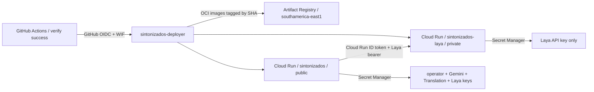

# Runtime deployment

El despliegue usa Artifact Registry y dos servicios Cloud Run; no requiere
volúmenes, shell dentro de la imagen, Compose o una VM.



`./scripts/cloud bootstrap` crea recursos faltantes de forma idempotente. Las
imágenes son:

```text
southamerica-east1-docker.pkg.dev/PROJECT/sintonizados/gateway:GIT_SHA
southamerica-east1-docker.pkg.dev/PROJECT/sintonizados/laya:GIT_SHA
```

El workflow `deploy.yml` arranca después de CI `verify` exitoso en un push de
`main`, o manualmente desde `main` luego de verificar que el SHA tiene CI verde.
Usa el Environment `production`, WIF restringido a repository ID, ref main y el
environment claim. No hay credenciales persistentes de GitHub ni service account
JSON keys. Tanto Actions como la terminal usan `scripts/cloud`.

## Gateway

Cloud Run `sintonizados` escucha port 8080, público para lecturas y limitado a una
instancia. Asignación inicial: 1 vCPU, 1 GiB, `min=1`, `max=1`, concurrency 40,
CPU siempre asignada, timeout 3600 s. Secret Manager aporta OPERATOR_TOKEN,
GEMINI_API_KEY, GOOGLE_TRANSLATION_API_KEY y LAYA_API_KEY. Escrituras y métricas
siguen comprobando OPERATOR_TOKEN.

## Laya privado

Cloud Run `sintonizados-laya` no permite llamadas anónimas, escucha port 8000 y
usa 2 vCPU, 4 GiB, `min=1`, `max=1`, concurrency 2, CPU siempre asignada.
`sintonizados-laya` sólo puede leer su clave LAYA_API_KEY. La service account del
gateway sólo tiene `roles/run.invoker` sobre este servicio.

Con `LAYA_CLOUD_AUDIENCE` configurado, `MetadataIDTokenProvider` obtiene de la
metadata server de Cloud Run un ID token ADC para el audience del servicio,
cacheado hasta un minuto antes de su expiración. Go lo envía mediante
`X-Serverless-Authorization`. `Authorization` sigue llevando el bearer
`LAYA_API_KEY` que comprueba la aplicación Laya. Si el audience está vacío,
el adapter conserva el modo local actual. Si está configurado y falla la emisión
del token, la decisión falla de forma explícita y el pipeline utiliza el fallback
determinista ya implementado.

## Estado local y réplicas

`SessionStore` y `EventBus` continúan en memoria. `max=1` limita la incoherencia
entre réplicas, pero reemplazos o revisiones pueden perder sesiones y el rollout
puede coexistir brevemente. No hacer deploy durante charlas activas. La afinidad
de sesión no soluciona esto; resolver el ownership distribuido de [issue #7](https://github.com/munhof/sintonizados/issues/7)
antes de escalar.

## Laya checkpoint y operación

El checkpoint `laya-multilingual` (Apache 2.0) ocupa 644 MB y se descarga de
Hugging Face al iniciar; la imagen Laya construida mide 1.31 GB. `min=1` conserva
el modelo caliente, aunque una revisión nueva aún debe descargar y precargarlo.
El pipeline de CD espera Cloud Run Ready y confirma `/health` autenticado con el
modelo multilingual cargado. El tiempo medido desde `gcloud run deploy` hasta ese
health es un límite superior del startup, pues incluye operaciones del control
plane.

El código Laya está fijado, pero el snapshot de pesos de Hugging Face no se fija
actualmente. El SHA observado es `55cf4c4ebb4ebe31b2550e8bdf3bd21b99753851`;
un cache nuevo puede descargar el `main` posterior. La calidad lingüística sigue
sin validar (#12), incluso si el servicio responde salud.

No hay VM, Cloud Run Worker Pools, Pub/Sub, Redis, Firestore, Kubernetes o bases
de datos en el MVP.
