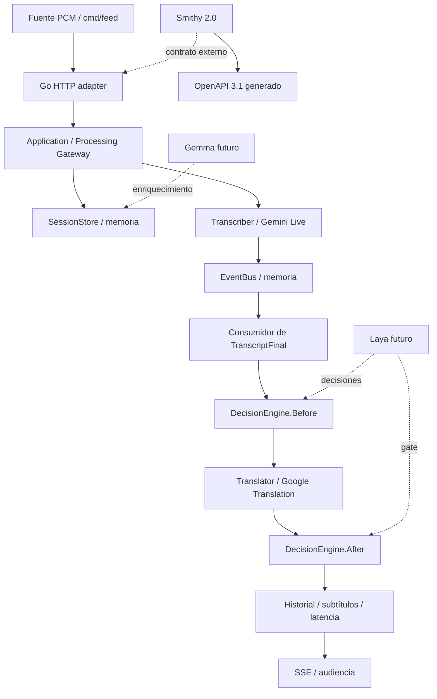

# Arquitectura

El Processing Gateway es el servicio de aplicación dentro del proceso Go, sin
una segunda API o microservicio prematuro. Los adaptadores implementan puertos
del dominio. No se genera servidor Go desde Smithy.

| Directorio | Responsabilidad |
| --- | --- |
| `internal/domain` | Sesiones, conocimiento, eventos, puertos de IA y estado |
| `internal/application` | Ciclo de vida y pipeline por sesión |
| `internal/adapters/memory` | Store con snapshots y bus con backpressure |
| `internal/adapters/google` | WebSocket Gemini y REST Translation |
| `internal/adapters/http` | DTO, validación de entrada, auth y vistas embebidas |
| `api/smithy` | Contrato público; no importado por el dominio |

Memoria y bus son deliberadamente locales. Reemplazar sólo el store no basta
para múltiples réplicas: hay que resolver ownership del stream, secuencias,
entrega durable y fanout. Ver [sesiones](sessions.md) y [eventos](events.md).
