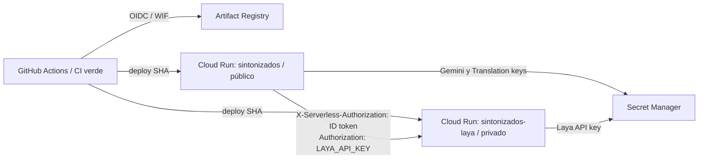

# Google Cloud — Cloud Run y GitHub CD

El despliegue del MVP usa dos servicios Cloud Run en `southamerica-east1` y una
imagen OCI por servicio. El gateway público conserva su estado sólo en memoria y
queda limitado a una instancia; Laya es privado y recibe identidad de servicio.
No hay VM, base de datos, broker ni worker pool.



## Proyecto y recursos

```text
Project: sintonizados-509702
Region: southamerica-east1
Artifact Registry: southamerica-east1-docker.pkg.dev/sintonizados-509702/sintonizados
Gateway: sintonizados
Decision service: sintonizados-laya
```

El wrapper usa la cuenta autenticada dentro del volumen Podman `sintonizados-gcloud`.
No requiere instalar gcloud, Go, Python o Java en el host. La región default está
en el script y se puede cambiar con `GOOGLE_CLOUD_REGION`.

## Bootstrap idempotente

La sesión del operador necesita permisos para habilitar APIs, crear Artifact
Registry, service accounts, IAM, Workload Identity Federation y Secret Manager.
El proyecto debe tener billing. El bootstrap habilita sólo las APIs de este
despliegue, crea recursos que falten y conserva los existentes:

```sh
export GOOGLE_CLOUD_PROJECT=sintonizados-509702
export GOOGLE_CLOUD_REGION=southamerica-east1
./scripts/cloud bootstrap
```

`bootstrap` crea el repositorio `sintonizados`, las service accounts indicadas
abajo y estos secretos si no existen:

```text
sintonizados-operator-token
sintonizados-gemini-key
sintonizados-translation-key
sintonizados-laya-api-key
```

Si no tienen versiones, intenta cargar las tres primeras desde las variables
homónimas de `.env` (o `SECRET_ENV_FILE`). Nunca imprime sus valores. Genera el
token interno de Laya con bytes aleatorios y también lo carga sin mostrarlo. Si
no hay valor local para una clave externa, agregar una versión desde Secret
Manager; no pegar secretos en comandos, GitHub Variables, workflow o imagen.
Bootstrap no rota versiones existentes.

### Identidades y permisos

| Service account | Uso | Permisos |
| --- | --- | --- |
| `sintonizados-runtime@PROJECT.iam.gserviceaccount.com` | Gateway | Secret Accessor únicamente en los cuatro secretos; Run Invoker sobre Laya |
| `sintonizados-laya@PROJECT.iam.gserviceaccount.com` | Laya | Secret Accessor únicamente en `sintonizados-laya-api-key` |
| `sintonizados-deployer@PROJECT.iam.gserviceaccount.com` | GitHub Actions | Run Admin y Service Usage Consumer en el proyecto; Artifact Registry Writer sólo en `sintonizados`; Service Account User sobre las dos identidades runtime; Run Invoker sobre Laya para su health check |

El workflow no tiene Owner ni Editor. No se crean ni descargan claves JSON.
`sintonizados-laya` no recibe credenciales de Gemini ni Translation. El acceso
Laya de runtime se restringe además mediante Cloud Run IAM.

## GitHub OIDC / Workload Identity Federation

El bootstrap configura:

```text
Pool: github
Provider: github-sintonizados
Issuer: https://token.actions.githubusercontent.com/
Repository ID: 1386560953 (munhof/sintonizados)
Condition: repository + refs/heads/main + environment production
Impersonated service account: sintonizados-deployer@PROJECT.iam.gserviceaccount.com
```

El principal del pool sólo puede impersonar el deployer. La condición del
provider y la branch policy del Environment exigen `main` y `production`.
El Environment no agrega una aprobación manual.

GitHub Environment `production` tiene estas **variables**, no secretos:

```text
GCP_PROJECT_ID
GCP_REGION
GCP_WIF_PROVIDER
GCP_DEPLOY_SERVICE_ACCOUNT
```

Las cuatro ya se preparan con `./scripts/cloud bootstrap` o se pueden volver a
configurar con `./scripts/cloud github-config`. Gemini, Translation, operator y
Laya keys permanecen en Secret Manager; no hay credenciales GCP en GitHub.

## Imágenes y versiones

El tag de cada despliegue es el SHA Git completo; el repositorio aplica
inmutabilidad de tags, por lo que cada tag mantiene un único digest:

```text
southamerica-east1-docker.pkg.dev/PROJECT/sintonizados/gateway:GIT_SHA
southamerica-east1-docker.pkg.dev/PROJECT/sintonizados/laya:GIT_SHA
```

No se publica `latest`. `bootstrap` activa `--immutable-tags` también en un
repositorio existente. `push` verifica esa política y omite una imagen SHA que ya
exista; el Cloud Run revision, digest de Artifact Registry y SHA se registran en
los logs de CD. El rollback selecciona una revisión existente; no reconstruye la
imagen antigua. Artifact Registry permite habilitar esta política en Docker y
rechaza reasignar un tag inmutable ([documentación oficial](https://cloud.google.com/artifact-registry/docs/repositories/update-repo-settings)).

## CI/CD

`.github/workflows/ci.yml` sigue siendo el único CI y conserva sus verificaciones.
`.github/workflows/deploy.yml` escucha la finalización de `verify` y sólo despliega
una corrida `push` exitosa del propio `main`. `workflow_dispatch` también está
disponible desde `main` y consulta que CI haya pasado para ese mismo SHA. El job
usa GitHub Environment `production`, GitHub OIDC y `google-github-actions/auth`;
no necesita key JSON.

La misma lógica de despliegue está en `scripts/cloud`, que se usa tanto desde
terminal (gcloud OCI autenticado) como desde Actions (gcloud del runner autenticado
por WIF):

```sh
./scripts/cloud build all
./scripts/cloud push all
./scripts/cloud deploy all
./scripts/cloud status
```

`deploy all` publica los dos tags, despliega Laya, espera que Cloud Run esté Ready
y que su `/health` autenticado reporte `multilingual`, y después despliega y prueba
el gateway. En GitHub Actions, el despliegue se inicia automáticamente al pasar CI.

## Cloud Run y autenticación

| Servicio | IAM/entrada | CPU/RAM | Instancias min/max | Concurrencia | CPU |
| --- | --- | --- | --- | --- | --- |
| `sintonizados` | público para lectura; escrituras/métricas requieren `OPERATOR_TOKEN` | 1 / 1 GiB | 1 / 1 | 40 | siempre asignada |
| `sintonizados-laya` | privado, sólo callers con `roles/run.invoker` | 2 / 4 GiB | 1 / 1 | 2 | siempre asignada |

Gateway usa port 8080 y timeout 3600 s para SSE; Laya usa port 8000 y CPU con
`LAYA_DEVICE=cpu`, `LAYA_MODELS=multilingual`, `LAYA_THREADS=2` y precarga.
`MAX_SESSIONS=16`. No aumentar el máximo de gateway mientras `SessionStore` y
`EventBus` sean locales: varias instancias pueden dividir el estado y sticky
sessions no dan consistencia. Resolver [issue #7](https://github.com/munhof/sintonizados/issues/7)
antes de escalar o hacer rollout durante una charla.

En local, `LAYA_CLOUD_AUDIENCE` está vacío y continúa el bearer Laya opcional. En
Cloud Run, el gateway pide a Metadata Server un ID token ADC para el audience de
Laya y lo envía en `X-Serverless-Authorization`; `Authorization: Bearer ...`
conserva `LAYA_API_KEY` para el servicio Laya. Los dos encabezados cubren capas
distintas. El adapter de Go no depende de un archivo de service account.

Se puede degradar sin recompilar/desplegar una imagen nueva, creando una revisión
de configuración:

```sh
DECISION_ENGINE=deterministic ./scripts/cloud deploy gateway
```

Esto conserva Google Translation con autodetección; no demuestra clasificación
Laya. La clasificación real sigue sin estar validada en [issue #12](https://github.com/munhof/sintonizados/issues/12).

## Laya y pesos

Se verificó el model card oficial: Apache 2.0; `laya-multilingual` indica 322 M
parámetros y su archivo `model.safetensors` ocupa 644 MB ([model card](https://huggingface.co/convaiinnovations/laya-multilingual), [archivos](https://huggingface.co/convaiinnovations/laya-multilingual/tree/main)).
La imagen OCI instalada localmente mide 1.31 GB. Para el MVP, se mantiene la
descarga de pesos por upstream al iniciar con `min=1`: evita añadir otros 644 MB
a la imagen y no agrega almacenamiento. El despliegue mide el tiempo hasta Ready.
El código upstream está fijado, pero el snapshot de Hugging Face no se fuerza en
un cache nuevo; se observó `55cf4c4ebb4ebe31b2550e8bdf3bd21b99753851`. Por eso
la imagen es inmutable por SHA, mientras que la descarga inicial del modelo aún
es una limitación de reproducibilidad. No se predescargan pesos hasta verificar
el inicio real de Cloud Run.

Un `/health` exitoso con el modelo cargado sólo valida disponibilidad técnica.
El checkpoint real dio `unknown` en tres ejemplos claros; no afirmar calidad de
idioma. Ver [operación Laya](laya.md) y #12. No se despliega VM: el primer intento
es Cloud Run y sólo se evaluaría otra plataforma con evidencia de límites reales.

## Estado y observabilidad

```sh
./scripts/cloud status
./scripts/dev gcloud run services describe sintonizados --region=southamerica-east1
./scripts/dev gcloud run revisions list --service=sintonizados --region=southamerica-east1
./scripts/dev gcloud logging read 'resource.type="cloud_run_revision" AND resource.labels.service_name="sintonizados"' --limit=100
```

`/health` indica liveness y modo, no validez de claves o conectividad con Gemini.
Los logs del gateway registran session IDs y latencias por subtítulo, sin audio,
transcripción ni claves. Cloud Monitoring ofrece consumo de CPU/memoria por
revisión; verificar después de ejecutar pruebas reales. `laya_deploy_to_ready_seconds`
es elapsed desde `gcloud run deploy` hasta health con multilingual cargado; incluye
control plane y no es sólo tiempo del proceso.

## Health y pruebas fuera de localhost

El CD comprueba Laya `/health` autenticado, Gateway `/health`, página principal y
listado público de sesiones desde el runner de GitHub. Para comprobar el flujo SSE
de una sesión existente:

```sh
SMOKE_SESSION_ID=charla-a ./scripts/cloud smoke gateway
```

La aceptación de issue #2 también requiere crear sesión, ver SSE desde navegador
externo y probar dos flujos con audio real. No usar `demo` para dar por probados
Gemini, Translation, Laya o dos charlas reales. El gateway mantiene la retención
en memoria actual; sus reinicios/revisiones pueden perder sesiones.

## Rollback

Listar revisiones y elegir una que ya exista:

```sh
GOOGLE_CLOUD_PROJECT=PROJECT ./scripts/dev gcloud run revisions list --service=sintonizados --region=southamerica-east1
GOOGLE_CLOUD_PROJECT=PROJECT ./scripts/cloud rollback gateway sintonizados-REVISION
GOOGLE_CLOUD_PROJECT=PROJECT ./scripts/cloud rollback laya sintonizados-laya-REVISION
```

El servicio vuelve a enviar 100% del tráfico a esa revisión. Confirmar URL,
health, SSE y logs. Los cambios de configuración también crean revisiones, por lo
que documentar el SHA no identifica por sí solo variables/secrets de runtime.

## Costos y teardown

Min instances 1 y CPU siempre asignada mantienen una instancia de cada servicio
activa aun sin público. Laya usa 2 vCPU y 4 GiB; el gateway 1 vCPU y 1 GiB. También
se factura el almacenamiento de dos imágenes por commit. El costo depende del
tiempo, región y volumen de registros; revisar Billing antes de dejarlo encendido
fuera de la demo.

Para conservar servicios y configuración pero permitir scale-to-zero:

```sh
GOOGLE_CLOUD_PROJECT=PROJECT ./scripts/cloud scale-down
```

Para apagar y eliminar sólo los dos servicios Cloud Run (mantiene Artifact
Registry, secretos, IAM y WIF):

```sh
GOOGLE_CLOUD_PROJECT=PROJECT ./scripts/cloud destroy-demo --confirm
```

El teardown no forma parte del CI. No hay `VM` que apagar. Secretos nunca se borran
con este comando; borrarlos requiere una acción separada y deliberada.
